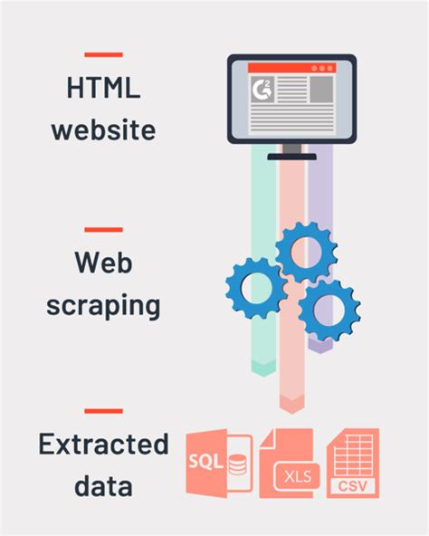

# Web Scraper

In this project, I developed a Python script able to scrape data (title, price and rating) from a bookstore, generate a CSV file from this data and also store this data into a SQLite3 database.

## Tools

• Python 3.6.9

• BeautifulSoup4

• Requests

• SQLite3

• Pandas

## How To Run This Script?

1. You need Python.

2. Download the script.

3. Put .PY script into a folder.

4. Run the script.
